# 🔎 VECTOR_SEARCH with Flink + Confluent Cloud + MongoDB + VoyageAI — equipment maintenance mock dataset

A hands-on, copy‑paste friendly walkthrough that highlights **VoyageAI text embeddings** and **Confluent Flink SQL `VECTOR_SEARCH`**, using a mix of **click‑ops** (web UIs) and **simple CLI/scripts**. No Docker. No sprawling infra. Just enough to learn quickly and extend later.

<br>

## 🧭 Overview

As agentic AI rises, **RAG** (retrieval‑augmented generation) still does the heavy lifting for grounding answers in recent, relevant data. This repo shows how **streaming + embeddings + vector search** fit together with:
- **Flink SQL** on **Confluent Cloud** (managed Flink)
- **VoyageAI** for fast, high‑quality text embeddings
- **MongoDB Atlas** for a **vector index** and semantic search

**Who is this for?** Builders who want a *minimal* but real demo of vector search and a path to future agentic workflows—without standing up complex services.

**You will:**  
- Wire up Flink SQL with VoyageAI embeddings and MongoDB Atlas vector search  
- Run end‑to‑end queries from a small Python producer into Flink SQL  
- Explore `VECTOR_SEARCH` directly in SQL
- Keep everything readable and easy to swap for your own data later

> Assumptions: macOS (or equivalent), Python installed, and you’re comfortable with `pip install python-dotenv` and basic terminal use.

✅ Prereqs (Python & OS)
- Python: 3.10+
- macOS should work out of the box

Something like this, from the repo root
- confluent-kafka[avro] — Kafka producer + Schema Registry Avro serializer
- pymongo — MongoDB client
- voyageai — VoyageAI embeddings client
- python-dotenv — loads your .env file

```bash
python3 -m venv .venv
source .venv/bin/activate
python -m pip install -U pip
pip install "confluent-kafka[avro]" pymongo voyageai python-dotenv
```

<br>

## 🧠 What You Will Accomplish

- Spin up a **Flink SQL** pipeline on **Confluent Cloud** with minimal setup.  
- Create a **MongoDB Atlas** vector index and query it via Flink.  
- Use **VoyageAI** to embed text into vectors for similarity search.  
- Run **`VECTOR_SEARCH`** in Flink SQL to power agentic/RAG‑style lookups.  
- Watch data flow end‑to‑end—**no Docker, no complex services**.

<br>

## 📚 What You Will Learn

- Quick setup of **Confluent Cloud**, **MongoDB Atlas**, and **VoyageAI** (UI + CLI).  
- How to create and use tables in **Flink SQL**.  
- How embeddings and vector indexes work together (VoyageAI ↔ MongoDB Atlas).  
- Patterns that are **simple to learn** and **easy to extend**.

<br>

## 🏗️ Architecture Diagram

```
        +---------------------+
        |   Confluent Cloud   |   (UI + CLI for mgmt)
        +----------+----------+
                   |
                   v
             +-----+-----+
             |   Flink   |   (SQL, VECTOR_SEARCH)
             +-----+-----+
                   |
   +---------------+---------------+
   |                               |
   v                               v
+----------+                 +-------------+
| VoyageAI |  (Embeddings)   | MongoDB     |
|   API    +----------------> | Atlas       |
+----------+      vectors     | (Vector IX) |
                              +-------------+
```

<br>

## 🔄 Data Flow

**Flink SQL → VoyageAI**  
Mock equipment maintenance text (IoT‑ish) is embedded via the VoyageAI API. The Python script writes messages (with vectors) into Kafka → available to Flink SQL.

**Flink SQL → MongoDB Atlas**  
Flink queries a MongoDB **external table** that points at a **vector index** and uses `VECTOR_SEARCH` to retrieve similar documents.

**Confluent Cloud UI/CLI ↔ Flink SQL**  
Use the Confluent UI or CLI to set up environments, topics, and a Flink compute pool, then launch the Flink SQL shell.

<br>

## 🧪 Setup

### ✅ Confluent Cloud (UI)

1) Sign up / sign in: https://confluent.cloud/  
2) In the UI, create:  
   - A **free environment**  
   - A **free Kafka cluster**  
   - A **Flink compute pool**

**💬 Pro tip — Confluent AI Assistant:** In the UI, use the built‑in assistant to fetch **Environment ID** / **Cluster ID** and generate CLI commands.

<table>
  <tr>
    <td>
      <a href="./images/create_cfltenvironment.jpg" target="_blank">
        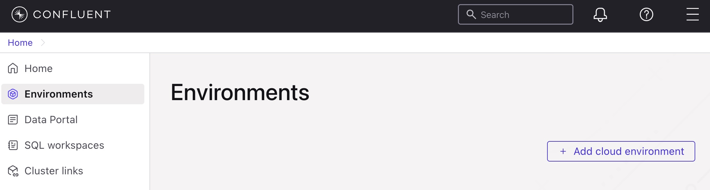
      </a>
    </td>
  </tr>
  <tr>
    <td>
      <a href="./images/create_cfltenvironment2.jpg" target="_blank">
        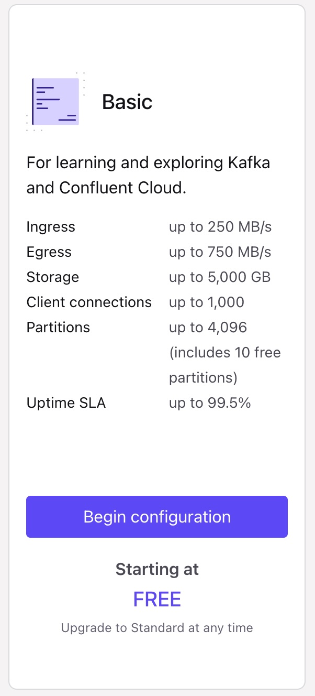
      </a>
    </td>
  </tr>
  <tr>
    <td>
      <a href="./images/create_cfltenvironment3.jpg" target="_blank">
        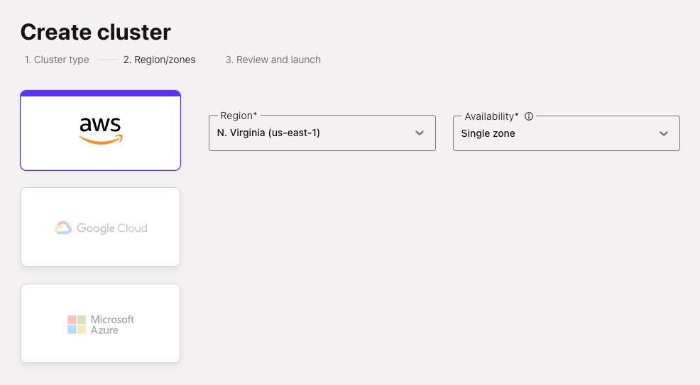
      </a>
    </td>
  </tr>
  <tr>
    <td>
      <a href="./images/create_cfltenvironment4.jpg" target="_blank">
        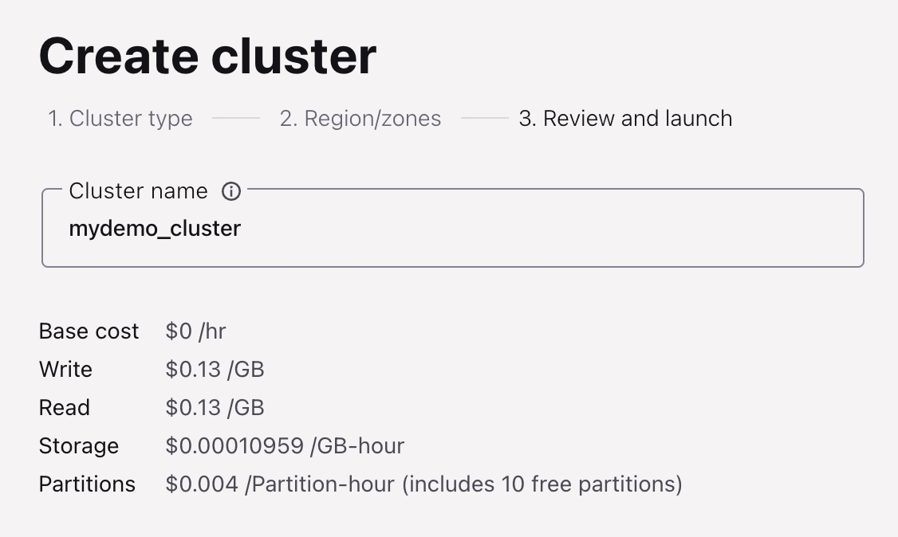
      </a>
    </td>
  </tr>
  <tr>
    <td>
      <a href="./images/create_cfltenvironment5.jpg" target="_blank">
        
      </a>
    </td>
  </tr>
  <tr>
    <td>
      <a href="./images/create_cfltenvironment_flink.jpg" target="_blank">
        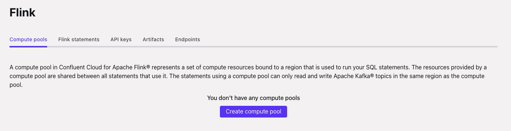
      </a>
    </td>
  </tr>
  <tr>
    <td>
      <a href="./images/create_cfltenvironment_flink1.jpg" target="_blank">
        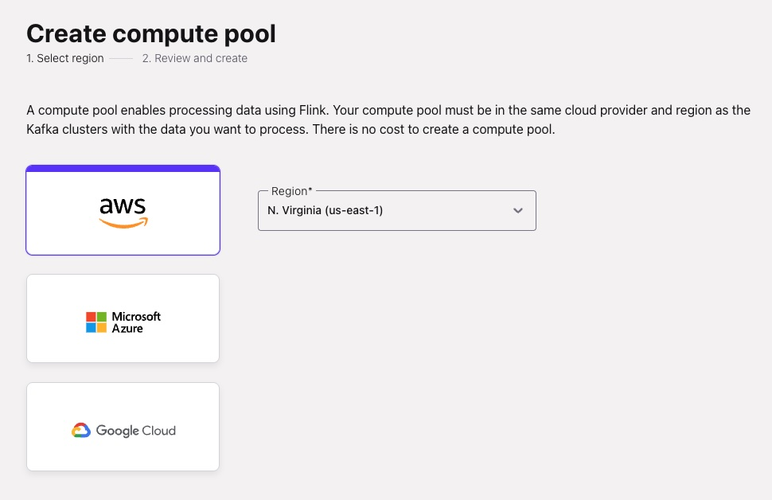
      </a>
    </td>
  </tr>
  <tr>
    <td>
      <a href="./images/create_cfltenvironment_flink2.jpg" target="_blank">
        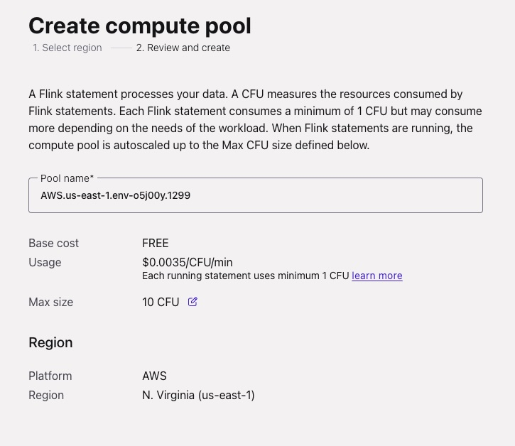
      </a>
    </td>
  </tr>
</table> 

### ✅ MongoDB Atlas

1) Sign up: https://cloud.mongodb.com/  
2) Create a free cluster, then create:  
   ```text
   database: VoyageDemo
   collection: equipment_maintenance_externaldb_embeddings
   ```
3) Create a **vector index** (JSON editor), name: `equip_maint_vector_index`  
   ```json
   {
     "fields": [
       {
         "type": "vector",
         "path": "embeddings",
         "numDimensions": 1024,
         "similarity": "cosine"
       }
     ]
   }
   ```
   > Make sure `numDimensions` matches your VoyageAI model’s embedding size.

<table>
  <tr>
    <td>
      <a href="./images/mdb_createindex2.jpg" target="_blank">
        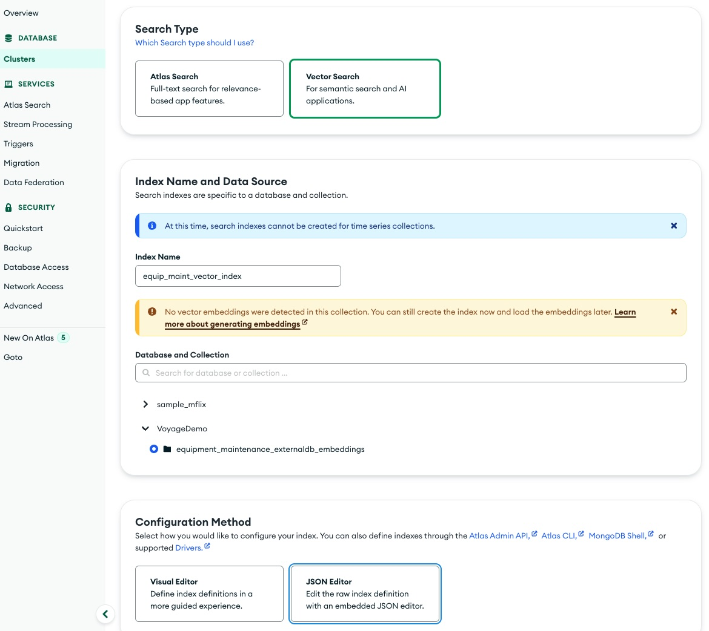
      </a>
    </td>
  </tr>
  <tr>
    <td>
      <a href="./images/mdb_createindex.jpg" target="_blank">
        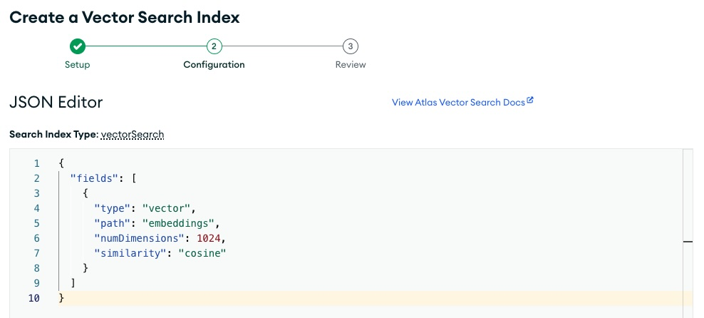
      </a>
    </td>
  </tr>
  <tr>
    <td>
      <a href="./images/mdb_viewindex_success.jpg" target="_blank">
        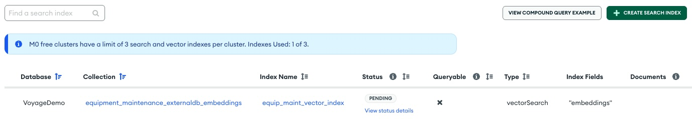
      </a>
    </td>
  </tr>
</table> 

💡 Tip: double-check cloud provider/region alignment and network access/IP allowlist in Atlas.
For now you may want to test with an open Internet not just your IP address.

<table>
  <tr>
    <td>
      <a href="./images/create_mdbenvironment4.jpg" target="_blank">
        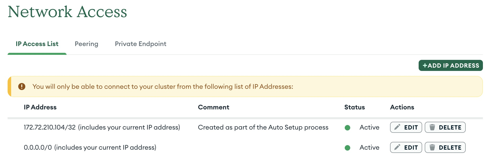
      </a>
    </td>
  </tr>
</table> 

### ✅ VoyageAI

- Create an API key from your VoyageAI dashboard (API Keys page).
- https://dashboard.voyageai.com/members
- Note your **model name** and **key** for the `.env` file.

<br>

### 🔧 CLI Tools

- Install **Confluent CLI**: https://docs.confluent.io/confluent-cli/current/install.html

<br>

## ⚙️ Run It

### 1) Configure `.env`
Set your values (API keys, cluster/pool IDs, etc.).

### 2) Generate mock data
This creates a mock dataset in your MongoDB Atlas database

```bash
python mockdata_equipment_maintenance_data_generator.py
```
📄 Script: [`mockdata_equipment_maintenance_data_generator.py`](./mockdata_equipment_maintenance_data_generator.py)

### 3) Create the input table for user queries (using Flink SQL workspace)
This creates a kafka topic that will store your command line query/input and VoyageAI embedding of the same

In the Flink SQL workspace execute the following SQL:
```sql
CREATE TABLE user_query_embeddings (
  msg STRING,
  vector ARRAY<FLOAT>
);
```

<table>
  <tr>
    <td>
      <a href="./images/flink_sql_createtable_embeddings.jpg" target="_blank">
        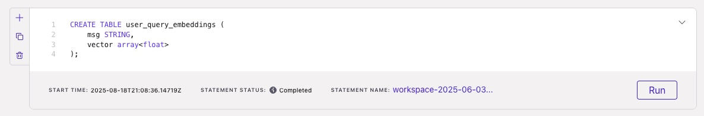
      </a>
    </td>
  </tr>
</table> 

### 4) Run the user‑query input program (Python)
Produces `{msg, vector}` Avro messages to your topic for Flink to query using the new kafka topic created above.

```bash
python run_equipment_maintenance_query.py
# Example input when prompted:
# alarm system malfunction
# then type 'exit' to quit
```
📄 Script: [`run_equipment_maintenance_query.py`](./run_equipment_maintenance_query.py)

<table>
  <tr>
    <td>
      <a href="./images/shell_running_query_program.jpg" target="_blank">
        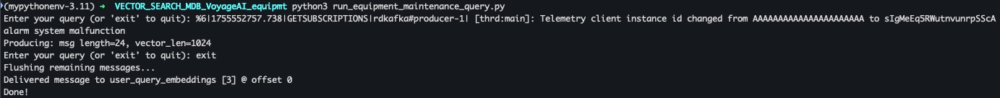
      </a>
    </td>
  </tr>
</table> 

### 5) Create a MongoDB connection (Confluent UI)
Now that you have data in MongoDB Atlas and Confluent Cloud (via a kafka topic), you can query both using Flink SQL.

Let's add a MongoDB Integration that Flink SQL can use to connect to MongoDB Atlas (connection name example): `mongodb-equip-maintenance`  

Example endpoint form:
```
mongodb+srv://<your-cluster>.mongodb.net/?retryWrites=true&w=majority&appName=<YourAppName>
```

<table>
  <tr>
    <td>
      <a href="./images/cc_createmdb_integration4.jpg" target="_blank">
        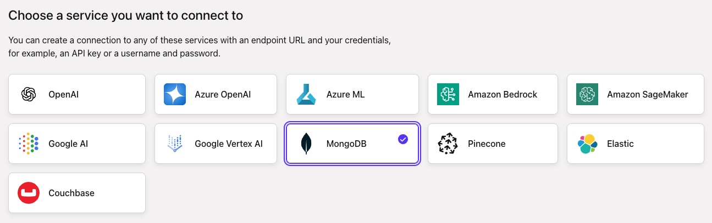
      </a>
    </td>
  </tr>
  <tr>
    <td>
      <a href="./images/cc_createmdb_integration3.jpg" target="_blank">
        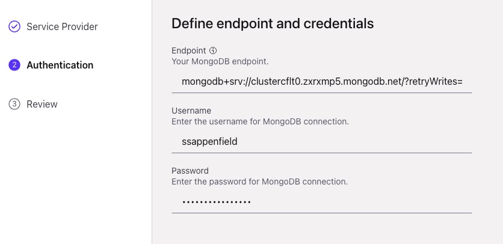
      </a>
    </td>
  </tr>
  <tr>
    <td>
      <a href="./images/cc_createmdb_integration2.jpg" target="_blank">
        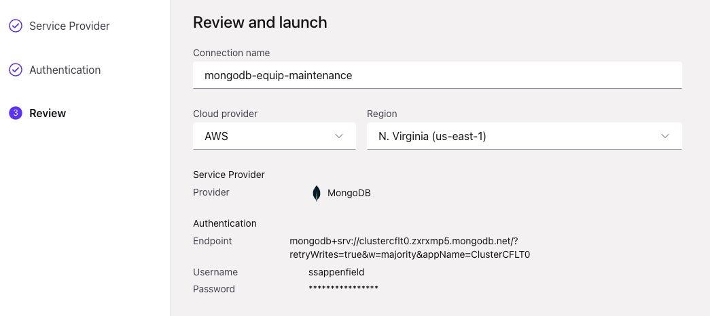
      </a>
    </td>
  </tr> 
  <tr>
    <td>
      <a href="./images/cc_createmdb_integration.jpg" target="_blank">
        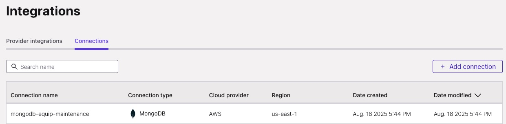
      </a>
    </td>
  </tr>   
</table> 

### 6) Create an external table for MongoDB (Flink SQL)
Flink SQL will reference an external table that uses that new connection you just created.

```sql
CREATE TABLE mongodb (
  actions_taken   STRING,
  equipment_id    STRING,
  equipment_type  STRING,
  reported_issue  STRING,
  severity_level  STRING,
  embeddings      ARRAY<FLOAT>
) WITH (
  'connector'             = 'mongodb',
  'mongodb.connection'    = 'mongodb-equip-maintenance',
  'mongodb.database'      = 'VoyageDemo',
  'mongodb.collection'    = 'equipment_maintenance_externaldb_embeddings',
  'mongodb.index'         = 'equip_maint_vector_index',
  'mongodb.embedding_column' = 'embeddings',
  'mongodb.numCandidates' = '3'
);
```

<table>
  <tr>
    <td>
      <a href="./images/flink_sql_createtable_externaltablemongodb.jpg" target="_blank">
        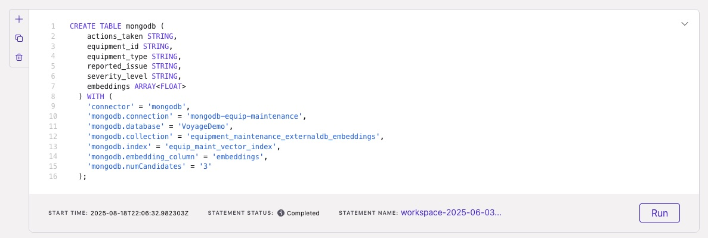
      </a>
    </td>
  </tr>
</table> 

### 7) Run VECTOR_SEARCH (Flink SQL)
Finally, run a Flink SQL statement that joins the Confluent Cloud kafka topic that has your input query (and embedding) against the external MongoDB Atlas database that has your mock dataset to do a proper vector search.

```sql
SELECT msg, search_results
FROM user_query_embeddings,
  LATERAL TABLE(VECTOR_SEARCH(mongodb, 3, DESCRIPTOR(embeddings), user_query_embeddings.vector)) AS search_results;
```

Expected output (shape):
```
msg: alarm system malfunction
search_results: Replaced main pressure sensor, recalibrated alarm sensitivity, performed comprehensive system diagnostic,VT-01,Ventilator Pro,Intermittent alarm system malfunction during patient ventilation,High, ...
```

<table>
  <tr>
    <td>
      <a href="./images/flink_sql_running_vectorsearch_lateraltable.jpg" target="_blank">
        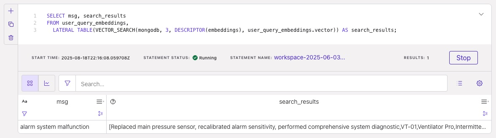
      </a>
    </td>
  </tr>
</table> 

<br>

## 🧩 Why VoyageAI + Flink `VECTOR_SEARCH`?

- **SQL‑native** similarity search over external (MongoDB) vectors—simple to operate.  
- **Fast, high‑quality embeddings** from VoyageAI, easy to call from Python.  
- **Composable**: swap in your own topics, collections, indexes, and models later.  
- **Agent‑ready**: this is the retrieval backbone for agentic/RAG systems.

<br>

## 🧯 Troubleshooting

- **Dimension mismatch**: Ensure `numDimensions` in the Mongo index equals your VoyageAI model’s vector size.  
- **Index not ready**: Wait for Atlas index build to finish before querying.  
- **Auth/connection errors**: Verify your MongoDB SRV string, IP allowlist, and Confluent connection name.  
- **Large messages**: If vectors get big, you may need to adjust Kafka/producer `max.request.size`.

<br>

## 🧹 Teardown

Manually delete your MongoDB Atlas cluster and any remaining Confluent Cloud resources (clusters, topics, compute pools) to avoid charges.

<br>

## 📌 Final Thoughts

This repo is intentionally lightweight and learning‑first:
- Real‑time streaming + vector search + embeddings in one flow  
- Clear building blocks you can **reuse** and **automate** (Terraform, SDKs, CI) later  
- A great starting point before you dive into bigger systems

Happy hacking! 🚀